  

<h1 align="center"> </h1>

if you like what i do, maybe consider buying me a coffee/tea 🥺👉👈

<h1 align="center"></h1>

<h2 align="center">
I'm a student of computer science and information technology 

</h2> 

<h3 align="center">My Social

<h1>
 <a href="https://www.github.com/ranjeetgtm" target="_blank" rel="noreferrer"> <picture> <source media="(prefers-color-scheme: dark)" srcset="https://raw.githubusercontent.com/danielcranney/readme-generator/main/public/icons/socials/github-dark.svg" /> <source media="(prefers-color-scheme: light)" srcset="https://raw.githubusercontent.com/danielcranney/readme-generator/main/public/icons/socials/github.svg" />  </picture> </a> <a href="http://www.instagram.com/ranjeet.gtm" target="_blank" rel="noreferrer"> <picture> <source media="(prefers-color-scheme: dark)" srcset="https://raw.githubusercontent.com/danielcranney/readme-generator/main/public/icons/socials/instagram-dark.svg" /> <source media="(prefers-color-scheme: light)" srcset="https://raw.githubusercontent.com/danielcranney/readme-generator/main/public/icons/socials/instagram.svg" />  </picture> </a> <a href="https://www.linkedin.com/in/ranjeetgtm" target="_blank" rel="noreferrer"> <picture> <source media="(prefers-color-scheme: dark)" srcset="https://raw.githubusercontent.com/danielcranney/readme-generator/main/public/icons/socials/linkedin-dark.svg" /> <source media="(prefers-color-scheme: light)" srcset="https://raw.githubusercontent.com/danielcranney/readme-generator/main/public/icons/socials/linkedin.svg" />  </picture> </a> </h1>

<h3 align="center">## 🧰 Technical Skills 

	
  

</h3>

<h3 align="center">### GitHub Stats</h3>

<h3 align="left">## 📬 How to reach me:</h3>

-👾 <a href="https://www.reddit.com/u/ranjeetgtm/s/Fe22a2EX8i">Reddit</a> - @𝓻𝓪𝓷𝓳𝓮𝓮𝓽𝓰𝓽𝓶

-💬 <a href="https://discord.com/invite/4ujSuJjg">Discord</a> - @𝓻𝓪𝓷𝓳𝓮𝓮𝓽𝓰𝓽𝓶

-📸 <a href="https://www.instagram.com/ranjeet.gtm?igsh=MWNiZGZwcW5nd2Ficw==">Instagram</a> - @𝓻𝓪𝓷𝓳𝓮𝓮𝓽.𝓰𝓽𝓶

-🌐 <a href="https://ranjitgautam.com.np">website</a> -𝓻𝓪𝓷𝓳𝓲𝓽𝓰𝓪𝓾𝓽𝓪𝓶.𝓬𝓸𝓶.𝓷𝓹

<h3 align="center"> ## 🔭 I'm currently working on </h3>         

- 𝑀𝓎 𝓃𝑒𝓌 𝓅𝓇𝑜𝒿𝑒𝒸𝓉𝓈
                          

- 𝑀𝓎 𝓃𝑒𝓍𝓉 𝒷𝓁𝑜𝑔
                              

-𝑀𝓎 𝓅𝓎𝓉𝒽𝑜𝓃 𝒮𝓀𝒾𝓁𝓁
                          

-𝐸𝒹𝒾𝓉𝒾𝓃𝑔 
                                  

<h3 align="right"> ## 🌱 I'm currently learning</h3>

-𝒿𝒶𝓋𝒶𝓈𝒸𝓇𝒾𝓅𝓉 

- 𝑅𝑒𝒶𝒸𝓉

- 𝒮𝓉𝓎𝓁𝑒𝒹 𝒞𝑜𝓂𝓅𝑜𝓃𝑒𝓃𝓉𝓈

-𝐸𝒹𝒾𝓉𝒾𝓃𝑔
 

 <h3 align="center"> ## 📊 GitHub Stats

 
 

</h3>

<h3 align="center">## 🤝 Connect with me:

	
	
 
 
</h3>

 

<h3 align="center">## Profile Views

</h3>

<h3 align="center">## Follow Me

<svg fill="none" viewBox="0 0 800 50" width="800" height="50" xmlns="http://www.w3.org/2000/svg">
</h3>

<h3 align="center">-💬If you have any question/feedback, please do not hesitate to reach out to me! 
 ranjitgautam893@gmail.com</h3>

  
</p
	
