  

<h1 align="center">
  
</h1>

  If you like what I do, maybe consider buying me a coffee or tea 🥺👉👈

  

<h2 align="center">
  I am a student of Computer Science and Information Technology
</h2>

<h3 align="center">My Social</h3>

  
  &nbsp;&nbsp;
  
  &nbsp;&nbsp;
  

<h3 align="center">🧰 Technical Skills</h3>

  

<h3 align="center">📊 GitHub Stats</h3>

  

<h3 align="center">📬 How to reach me</h3>

  📸 <a href="https://www.instagram.com/ranjeet.gtm">Instagram</a> — @ranjeetgtm_

  🌐 <a href="https://ranjitgautam.com.np">Website</a> — ranjitgautam.com.np

<h3 align="center">🔭 I'm currently working on</h3>

• My new projects

• Improving my coding skills

<h3 align="center">🌱 I'm currently learning</h3>

• JavaScript

• React

  
   
  

  

<h3 align="center">🤝 Connect with me</h3>

  
  &nbsp;
  

<h3 align="center">👁 Profile Views</h3>

  

<h2 align="center">
  💬 If you have any questions or feedback, feel free to reach out:
   
  📧 ranjitgautam693@gmail.com
</h2>

  

